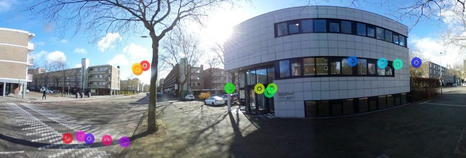

# Inspecting Aggregated Cycling Attention: Merging multiple eye-trackers

  <strong>Abstract</strong>
  

    As cycling is increasingly adopted as the future of sustainable mobility, governments are interested in making it safer. We use various senses during any traffic interaction, of which the visual is the most dominant. While eye-movement research in auto-motors is a mature field, the amount of research in cycling is relatively small. This research maps a single wearable eye-tracker to master footage using computer recognition, and evaluates both Scale Invariant Feature Transform (SIFT) and implementation of a Siamese Neural Network (SNN). Of both, SIFT obtained an accuracy of 52\% and the SNN an accuracy of 38.6\%. Both are not robust enough to build a reliable mapping but they can, however, establish a baseline for future research in this topic.  
    <a href='./0_data/6_report/v2-concept-final.pdf'>Download concept version of my thesis here.</a>
  

  

